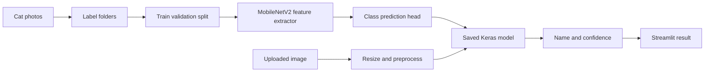

# Meko and Lily Cat Classifier

## Project Report

**Owner:** Muhamad Dinie Bin Muzaffar  
**Project type:** Personal computer-vision and machine-learning project  
**Status:** Phase 4 in progress — three-class model (Meko / Lily / Other) with held-out evaluation  
**Last updated:** 2026-09-18

## 1. Executive Summary

This project will train an image-classification model to distinguish between two cats, Meko and Lily. The first usable version will classify an uploaded image because a camera is not currently available on the PC. A later version will accept a webcam image through the same Streamlit application.

The project is intended as both a useful personal tool and a portfolio-quality demonstration of supervised learning, transfer learning, evaluation, and model serving.

## 2. Problem Statement

Given a photograph containing Meko or Lily, the system should estimate which cat is present and display:

- the predicted cat name;
- the confidence score for the prediction; and
- an uncertainty message when the model is not confident enough.

The system must not silently claim that every image is one of the two cats. Images that are unclear, contain another cat, or do not contain a cat should eventually be reported as `Unknown`.

## 3. Objectives

### In scope for version 1

1. Collect and label personal photos of Meko and Lily.
2. Train a two-class image classifier using transfer learning.
3. Evaluate it on photos that were not used for training.
4. Build a Streamlit interface for image upload.
5. Display the predicted name and confidence.
6. Record limitations and reproducible setup steps.

### Planned after version 1

1. Add a true `Unknown` decision using a confidence threshold and an unknown-image test set.
2. Add webcam capture when a camera is available.
3. Add a confusion matrix and precision/recall report.
4. Improve robustness using photos from different days, rooms, lighting, and distances.
5. Deploy the app privately or publish it only after reviewing the privacy of the cat photos.

### Out of scope

- Identifying every cat breed or every individual cat.
- Facial recognition for people.
- Training on employer, customer, banking, insurance, or production data.
- Treating a prediction as guaranteed identity verification.

## 4. Users and User Story

**Primary user:** The cat owner.

> As the owner, I want to upload a photo of a cat and see whether the model thinks it is Meko or Lily, so that I can test whether the model has learned the visual differences between them.

## 5. Functional Requirements

| ID | Requirement | Acceptance condition |
|---|---|---|
| FR-01 | The training data has separate folders for Meko and Lily. | Each labelled image belongs to exactly one class. |
| FR-02 | The model can be trained from the repository instructions. | `python train.py` creates a local model artifact. |
| FR-03 | The app accepts JPG, JPEG, and PNG images. | An uploaded supported image is displayed and classified. |
| FR-04 | The app shows the predicted class and confidence. | The result includes a name and percentage. |
| FR-05 | The app communicates uncertainty. | Low-confidence predictions show an uncertainty message. |
| FR-06 | The app can later accept a camera image. | The camera control is available when the browser and device provide camera access. |
| FR-07 | Personal image data is protected by default. | Photos and model files are ignored by Git. |

## 6. Non-Functional Requirements

- **Reproducibility:** A new virtual environment can install dependencies from `requirements.txt`.
- **Maintainability:** Training and inference are separated into `train.py` and `app.py`.
- **Usability:** A user can run the app locally with one Streamlit command after training.
- **Performance:** A single uploaded image should produce a result within a few seconds on a normal personal computer.
- **Privacy:** Photos remain local unless the owner explicitly chooses to publish them.
- **Honesty:** The interface must expose uncertainty and document known failure cases.

## 7. Data Plan

Photos are stored in this structure:

```text
data/cats/
├── lily/    # Lily only
├── meko/    # Meko only
└── other/   # any other cat (not Meko or Lily)
```

The `other` class lets the model reject random cats instead of forcing every
image into a Meko-or-Lily decision. The initial target is at least 30-50 varied
photos per cat for the personal classes, plus a larger, varied set for `other`.
The collection should include:

- different poses and body orientations;
- close-up and full-body views;
- different lighting conditions;
- different rooms and backgrounds;
- photos with and without collars or accessories; and
- images from different days.

Near-duplicate photos should not be split between training and validation data
because that can create an unrealistically high score.

Photos committed publicly are processed (downscaled to 448 px, EXIF/GPS
stripped, JPEG). Raw originals stay local under `data/originals/` and are
ignored by Git.

## 8. Technical Design

The baseline model uses **MobileNetV2 transfer learning** with ImageNet weights. Its convolutional base is frozen initially, and a small classification head learns the difference between the two cats.



### Training flow

1. Read images from the two class folders.
2. Resize images to 224 by 224 pixels.
3. Apply light augmentation during training.
4. Use MobileNetV2 as a pretrained feature extractor.
5. Train the classification head.
6. Save the best model and class-name order.

### Inference flow

1. Receive an uploaded image or camera image.
2. Convert it to RGB and resize it.
3. Run the trained model.
4. Select the class with the highest probability.
5. Display the name, probabilities, and confidence.
6. Warn when confidence is below the configured threshold.

## 9. Evaluation Plan

Accuracy alone is not sufficient. The test set should contain new photos from different days and conditions. `evaluate.py` trains a fresh model on a fixed-seed stratified split (default 80/10/10) and writes `models/evaluation_report.md`. The evaluation report includes:

- accuracy;
- precision and recall for Meko;
- precision and recall for Lily;
- precision and recall for Other;
- confusion matrix;
- confidence-threshold behaviour; and
- examples of incorrect or uncertain predictions.

A first practical target is at least 90% accuracy on a held-out test set of realistic new photos, while documenting the size and composition of that test set. This target is a guide, not a claim until measured.

## 10. Risks and Controls

| Risk | Effect | Control |
|---|---|---|
| Too few photos | Poor generalisation | Collect varied photos and use transfer learning. |
| Background leakage | Model recognises a room instead of a cat | Vary backgrounds and test in new locations. |
| Similar appearance | Meko and Lily are visually difficult to separate | Add close, clear examples and inspect errors. |
| Class imbalance | One cat is predicted too often | Keep class counts reasonably balanced. |
| Data leakage | Validation score looks falsely high | Keep near-duplicates in one split only. |
| Unknown cat or object | Forced wrong prediction | Add unknown images and a rejection threshold. |
| Privacy exposure | Personal photos become public | Keep the repository private and ignore image files by default. |

## 11. Delivery Plan

### Phase 1: Requirements and data collection

- Confirm the folder structure.
- Select and label the first photo set.
- Remove duplicates and unusable images.

**Deliverable:** A labelled local dataset with a short dataset note.

### Phase 2: Baseline training

- Install dependencies.
- Run the training script.
- Save the model locally.
- Record training and validation metrics.

**Deliverable:** A reproducible baseline model.

### Phase 3: Upload application

- Run the Streamlit app.
- Test known Meko and Lily images.
- Test blurry, empty, and unrelated images.

**Deliverable:** A local upload-based demo.

### Phase 4: Evaluation and improvement

- Create a held-out test set.
- Review false predictions.
- Add an unknown decision.
- Improve the dataset based on observed failure cases.

**Deliverable:** An evaluation report and a more trustworthy model.

### Phase 5: Camera and deployment

- Test browser camera capture when hardware is available.
- Keep upload as a fallback.
- Decide whether private local use or deployment is appropriate.

**Deliverable:** Camera-capable demo or documented reason to remain upload-only.

### Phase 6: Push the project to GitHub

Create a new GitHub repository, preferably private at first because the project uses personal cat photos. Before committing, check that photos, model files, virtual environments, and secrets are ignored.

From the project folder in PowerShell:

```powershell
git init
git add .
git status
git commit -m "Add Meko and Lily cat classifier"
git branch -M main
git remote add origin https://github.com/<your-username>/meko-lily-classifier.git
git push -u origin main
```

Replace `<your-username>` with the GitHub account name and use the repository URL created on GitHub. Do not put a GitHub password or access token in a file or command that gets saved in project documentation.

**Deliverable:** A GitHub repository containing the report, source code, setup instructions, and no private photos or generated model artifacts unless they were intentionally reviewed for publication.

## 12. Existing References

- [TensorFlow image classification tutorial](https://github.com/tensorflow/docs/blob/master/site/en/tutorials/images/classification.ipynb)
- [Keras transfer learning guide](https://github.com/keras-team/keras-io/blob/master/guides/transfer_learning.py)
- [Streamlit image classifier example](https://github.com/streamlit/example-app-image-classifier)

These references provide patterns for image loading, transfer learning, and Streamlit presentation. The Meko/Lily project remains a custom personal classifier with its own dataset and evaluation.

## 13. Current Decision

Proceed with upload-based classification first. Do not wait for camera hardware. The first milestone is reached when a clean held-out set of Meko and Lily photos can be classified through the Streamlit app and the measured results are documented.
