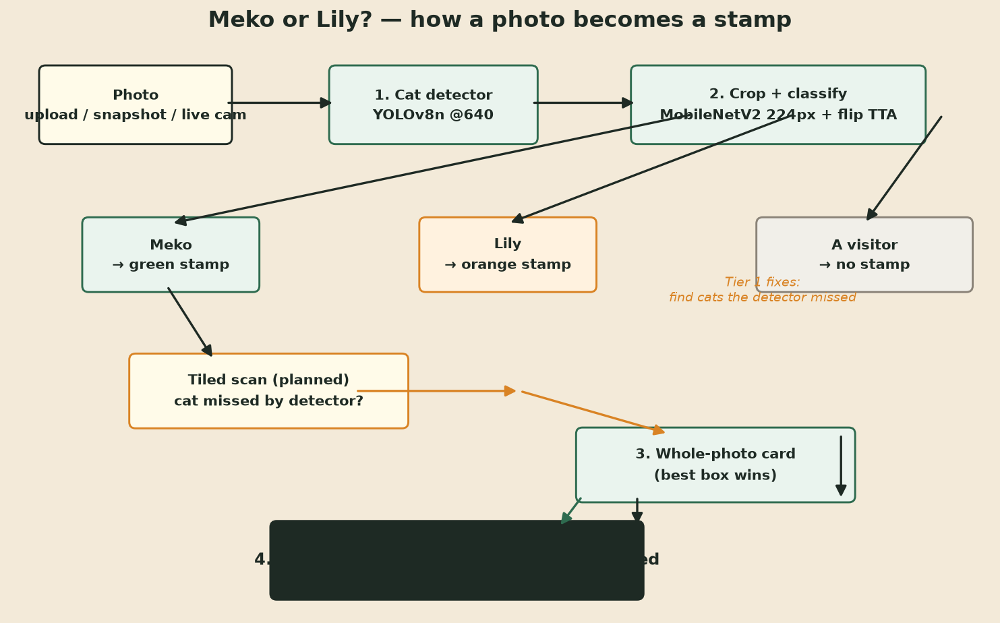
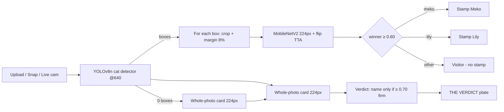

# Architecture — Meko or Lily?

A public, plain-English map of how the app turns a photo into a verdict.



## 1. Big picture

```
 ┌─────────┐   ┌──────────────────────┐   ┌───────────────────────┐
 │ PHOTO   │──▶│ 1. Cat detector      │──▶│ 2. Crop + classify    │
 │(upload/ │   │    YOLOv8n @640      │   │    MobileNetV2 @224   │
 │ snapshot│   │    looks for "cat"   │   │    flip-TTA, 0.60 cut │
 │ /live)  │   │    (COCO class 15)   │   │    ⇒ Meko / Lily /     │
 └─────────┘   └──────────────────────┘   │    other cat          │
                 │                         └──────────┬────────────┘
                 ▼                          per-box    ▼
 ┌──────────────────────┐   ┌──────────────────────────────┐
 │ 3. Whole-photo card  │   │ 4. Verdict (app.py)          │
 │    entire frame ──▶  │   │    best box name wins;       │
 │    224px ──▶ argmax  │──▶│    whole-photo only as card, │
 │    (reads the book)  │   │    stamp only if ≥ 0.70 firm │
 └──────────────────────┘   └──────────────────────────────┘
```



## 2. The steps

### Detection (`vision.py` — `CatDetector`)
- A tiny COCO-pretrained **YOLOv8n ONNX** detector looks for the generic class
  "cat" (COCO class 15) at 640px input.
- Boxes are filtered at confidence ≥ 0.25, non-max-suppressed at IoU 0.45.

### Crop classification (`vision.py` — `classify_crop`)
- Each detected box is cropped with an 8% margin.
- Resized to **224×224**, classified by a **MobileNetV2** model that has only
  three possible answers: `lily`, `meko`, `other`.
- Prediction is averaged with its horizontal flip (test-time augmentation).
- A cat is *named* (Meko/Lily) only when it wins **and** is ≥ 0.60; otherwise
  it is "other cat" (a visitor).

### Verdict (`app.py` — `resolve_verdict`)
- The whole photo is also squeezed to 224px and read once ("the book").
- The verdict plate is built from the **best box-level name**; the whole-photo
  read stamps a name only when it is firm (≥ 0.70) and nothing contradicts it.
- Fallback verdicts: *doubt* (winner sure enough but soft), *seam* (two cats
  tied).

## 3. Data lineage (full transparency)

- Raw personal photos were backed up to `data/originals/` (**never committed**).
- Every photo in `data/cats/` was re-encoded: RGB, longest side ≤ 448px,
  **EXIF / GPS stripped**, saved as JPEG — the only training data in Git.
- Class inventory (unique photos):
  - `lily` — **70**
  - `meko` — **141**
  - `other` — **4,955**
- The `other` class is capped and flattened from a larger rural cat dataset;
  it never contains Meko or Lily. The two registered cats cannot appear in
  `other`, by construction.

## 4. Runtime cost (approximate per 1MP photo)
| Step | Time |
|---|---|
| YOLOv8n detect @640 | ~40–80 ms |
| Per-box MobileNetV2 @224 | ~10–20 ms |
| Whole-photo card | ~10–20 ms |
| (live video adds tile scan fallback only, never on-route) | — |

Everything runs on CPU today; the GPU is used only for training (WSL).

## 5. Known limitations (public honesty)
- At 224px, small or distant cats are hard to tell apart — that is exactly
  what Tier 2 (320px, occlusion aug) targets.
- The COCO detector can miss a cat that is hidden or deeply occluded
  (e.g. "Lily in a bag") — Tier 1's tiled scan exists for that.
- Many-cat photos: the whole-photo card is unreliable on crowds; verdict logic
  prefers box names for this reason.