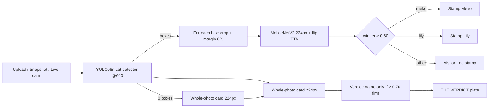

# Improvement Plan — "Find Meko & Lily wherever they are"

Status: **proposed** · Branch: `docs/improvement-plan` · Owner: Dinie

This document records the *plan* to make the app reliably find **Meko** and
**Lily** regardless of where they are in a photo: far away, half hidden,
occluded, in a bag, in a crowd of other cats, or scaled down into a composite.
Nothing here is merged yet — it is the roadmap the team reviews before any
code changes.

---

## 1. Why this plan exists

The current model (MobileNetV2 @ 224px, commit `4a96db4`, PR #9) already fixes
the worst reported bug: a photo of **Lily hidden in a bag** is now read as
**Lily** instead of **Meko**. On our fixed set of 7 unseen test photos the
result is **5/7 pass** (was 3/7).

The two remaining failures are not classifier mistakes in the usual sense —
they expose gaps in *where* the app looks:

| Test | What it is | Why it fails today |
|---|---|---|
| Test5 | A crowd of stray cats | The whole-photo card reads "doubt Lily 0.67" on a photo with **no registered cat** |
| Test6 | Edited image with both Meko and Lily | Detector finds 2 boxes, names **only Meko**; Lily's crop is read as "other cat" |
| (Test4) | Lily in a bag | **Detector returns 0 boxes** → cat never classified at crop level; only the whole-photo card catches it (Lily 0.50) |

Transparency note: lily has only **70 unique training photos** (meko 141,
other 4,955). Every new pose / position / occlusion / scale tests the model
where it is thinnest.

---

## 2. How the app works today (flow)

Components: `vision.py` (detector + crop classification), `app.py` (verdict +
stamps), `train.py` (training), `evaluate.py` (honest held-out numbers),
`models/detectors/yolov8n_coco.onnx`.

---

## 3. The plan (three tiers)

### Tier 1 — Inference: find them anywhere
Pure reading-side changes; model untouched.

| # | Change | Fixes |
|---|---|---|
| 1.1 | **Tiled sliding-window classifier scan** — run 224px crops over a stride grid when the detector returns 0–1 boxes; merge tile hits with detector boxes | Test4: cat is there but YOLO missed it |
| 1.2 | Low-confidence detector re-pass (`conf 0.15`) before declaring "no cat" | Far / small / occluded cats |
| 1.3 | Verdict prefers **box-level names**; whole-photo naming only when ≥ 0.70 firm and no box contradicts it | Test5: strays show "Lily?" |
| 1.4 | Latency guard: the tiled scan runs only as fallback, **never** on the live-video path | Keeps the webcam fast |

### Tier 2 — Model: stronger classifier (WSL-only training)
Same repo discipline as the retrain: training script changes live in WSL only.

| # | Change | Why |
|---|---|---|
| 2.1 | Input 224 → **320px** | More pixels on small / distant / occluded cats |
| 2.2 | Add **RandomCutout / occlusion** augmentation + scale jitter 0.7–1.3 | Directly mimics "Lily in a bag", "cat behind a chair" |
| 2.3 | Multi-crop TTA (flip + 2 scale levels) in `classify_crop` | More stable crops |
| 2.4 | Base upgrade MobileNetV2 → **EfficientNetB0** if 320px undershoots | More capacity for the 70-photo class |
| 2.5 | Keep repo `train.py` untouched; tuned copy runs in WSL | Repo hygiene |

### Tier 3 — Detector (biggest lever, decide later)
| # | Change | Why |
|---|---|---|
| 3.1 | YOLOv8n → **YOLOv8s/m** ONNX in `models/detectors/` | Better small / occluded-cat recall |
| 3.2 | *(stretch)* fine-tuned cat detector on our own data | Custom > COCO generic |

---

## 4. Verification (same bar as before)

- `holdout_test.py` on Test1–7 (**unseen**, read in place, never trained on) with a before/after table.
- New holdout metric: **"cat found at all" (detector recall)** so a missed box becomes visible instead of hiding behind "0 boxes".
- `evaluate.py` fresh 80/10/10 stratified run → per-class recall / precision / F1 + false-Meko rate.
- Every number is written into a checked-in doc so the public sees exactly what changed.

---

## 5. Open questions (locked before Tier 1 starts)

1. **Scope** — Tier 1 edits `vision.py` + `app.py` (previous round was model-only). Approved?
2. **Test photos** — keep Test1–7 frozen, or add unseen photos stressing position / distance / occlusion?
3. **Diagram format** — Mermaid in `.md` + one rendered PNG (this repo) is the plan.
4. **Tier 3 now or later?**

---

## 6. Version log

| Date | Change |
|---|---|
| 2026-09-19 | Plan created, PR #9 (retrain fix) still open for review |